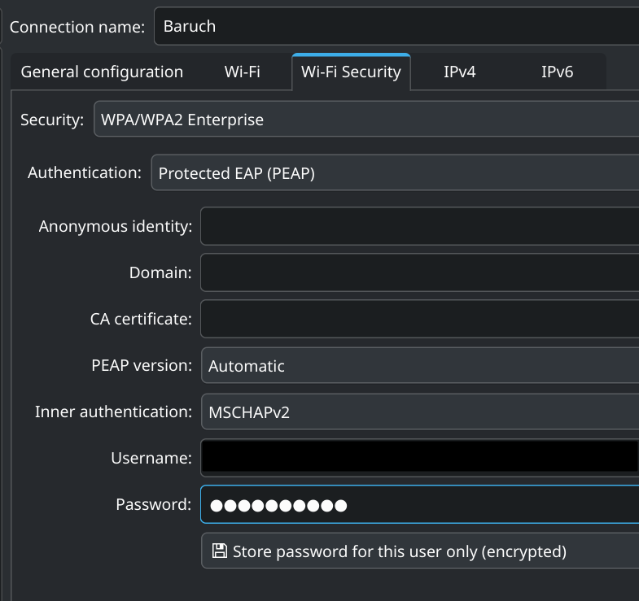

# baruch-wifi-on-Linux
Getting Baruch Main WiFi and eduroam working on Linux*

Hi, 

First time actually publishing a possibly useful repo out into the world, so if there's anything I need to change or improve upon, let me know.

Here's how to Configure Baruch Main WiFi and eduroam to work on Linux*

###### *The asterisk here refers to it only being tested on NixOS (my current distribution of choice) and Debian (u/Common_Grand8538 who prompted me to test and make this repo happen). All other distributions at the moment are unconfirmed. I will keep this updated if and when people reach out to me with a confirmed test or if a pull request is made. Also, both tests were made in a gui, KDE for me, and GNOME for u/Common_Grand8538, so the instructions reflect that. It's very likely possible for it to be done purely in CLI, but it's unconfirmed.

## Baruch Main WiFi (SSID <u>**Baruch**</u>)
###### (Works well with personal DNS preferences)
### On KDE:
1. Default configuration on most will be kept.
2. Just double check that under the Wi-Fi tab, mode is set as **Infrastructure** with everything else being unchecked or blank, and the following is set under Wi-Fi Security:
    - Security: WPA/WPA2 Enterprise
    - Auth: PEAP
    - CA cert: not in use
    - PEAP V: Automatic
    - Inner Auth: MSCHAPv2

3. Username and password are the same as the login for the printer portal, and can be reset via [mypassword.baruch.cuny.edu](https://www.mypassword.baruch.cuny.edu). Username follows the format of: firstinitial.lastname+(last 2 digits of SSN).
    - Ex: j.doe12

### On GNOME:

## eduroam (SSID <u>**eduroam**</u>)
###### (One of the main benefits of eduroam is that it's a worldwide system. As long as an institution is in collobration with eduroam, and you spot this SSID at another institution, this login should be exactly the same and work as normal. Also seems to be faster than Baruch Main. But the downside is that it uses TTLS PAP, which is generally considered to be a bit weaker than PEAP MSCHAPv2, so make of that what you will. Baruch's implementation uses TTLS PAP, but there are references in the installer for compatability with other methods, so it is possible that config may need to be altered, have not tested it with Linux but the universality of eduroam has been proven to work on other OS.)
###### (Does not work well with personal DNS prefernces, must insert DNS preferences elsewhere, such as in browser)

### On KDE:
1. Wi-Fi tab default config will be kept, similar to Baruch Main.
2. Under Wi-Fi Security tab, use the following configuration:
    - Security: WPA/WPA2 Enterprise
    - Auth: TTLS
    - Anon identity: anon@login.cuny.edu
    - Inner Auth: PAP
3. Username and password are the same as CUNY SSO (used for services like CUNYFirst, SB, Degreeworks, etc.). Username follows the format of firstname.lastname+(last 2 digits of EMPLID)@login.cuny.edu.
    - Ex. john.doe12@login.cuny.edu
5. For the CA cert, a copy of it has been provided in this repo for your convenience under the name eduroam-ca-certificate.pem. Keep this certificate in the same directory all other certificates are normally kept, in /etc/ssl/certs/ in your root directory. Link to this in the CA certificate section, and everything should work.

### On GNOME:

### Troubleshooting eduroam:
eduroam seems to be the finickiest out of the 2, so if you run into issues, here are some steps you can take.

1. Go to cat.eduroam.org and download the Linux installer for Baruch. The latest one at the time of writing has been provided in this repo for your convenience, but always check to see if the website has an even more up-to-date one.
2. Open the installer with your preferred code editor (it should still just be a Python file). Ignore all other code, except for the bottom-most portion starting at "Config.instname" (~ line 1231).
3. Troubleshoot the configuration:
    - Look at **Config.eap_outer**, **Config.eap_inner**, and **Config.anonymous_identity**. If these are different than the ones inputted, use the ones stated in the installation file.
4. Troubleshoot the CA cert:
    - Look at **Config.CA**. If it is different, copy the content inside the quotes, and overwrite the contents inside the .pem file.
    - I am not sure how often they replace these keys, it shouldn't be often as they affect quite a lot of things. A couple sources I've seen is usually around 20-30 years, but I do not know how Baruch handles this.

Hopefully this documentation proved helpful, this was one of the major pain points that prevented me from daily-driving NixOS (or your preferred distribution) from sophomore year. Now that this is solved, I can finally make more progress of fully daily-driving NixOS, and I hope you do the same.

